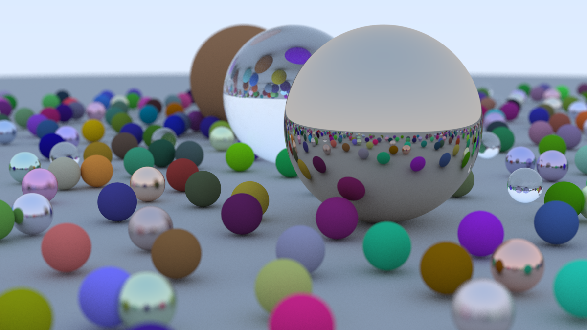

# Ray Tracing in One Weekend

(in Rust)

- Resolution: 1200x675 px
- Samples per Pixel: 500
- Max Depth: 50

## To do

- [ ] Refactor the `Hittable` trait so that `hit()` returns an `Optiona<HitRecord>` rather that a `bool`